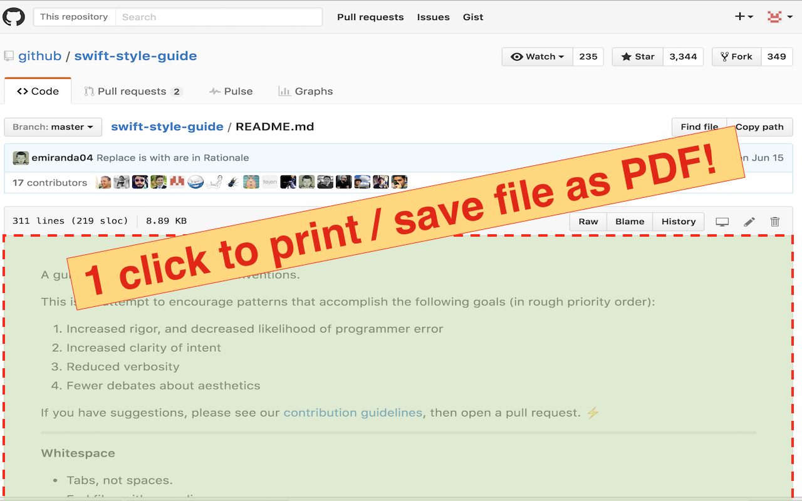
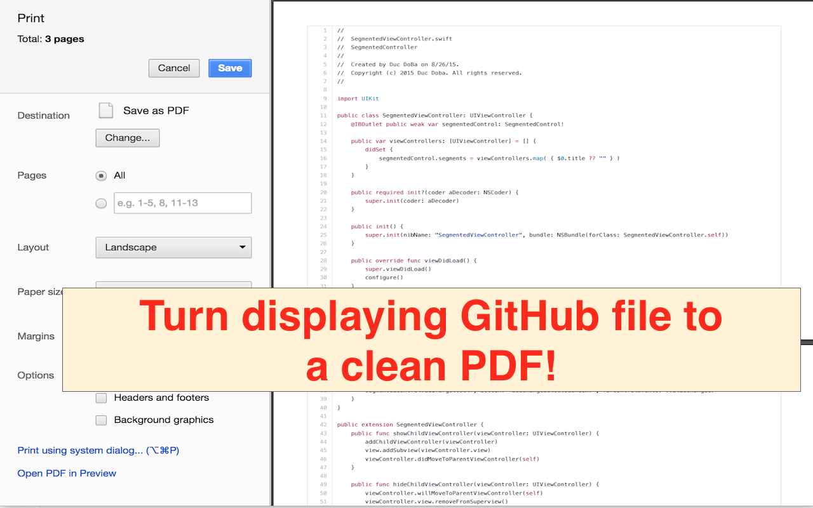

# GitHubPrinter
An useful Chrome Extension to print out currently displayed file on GitHub

[Now available on the Chrome Store](https://chrome.google.com/webstore/detail/github-printer/gkfcbphecmdiklloeebijingkjcakpgh)

Screenshots:

